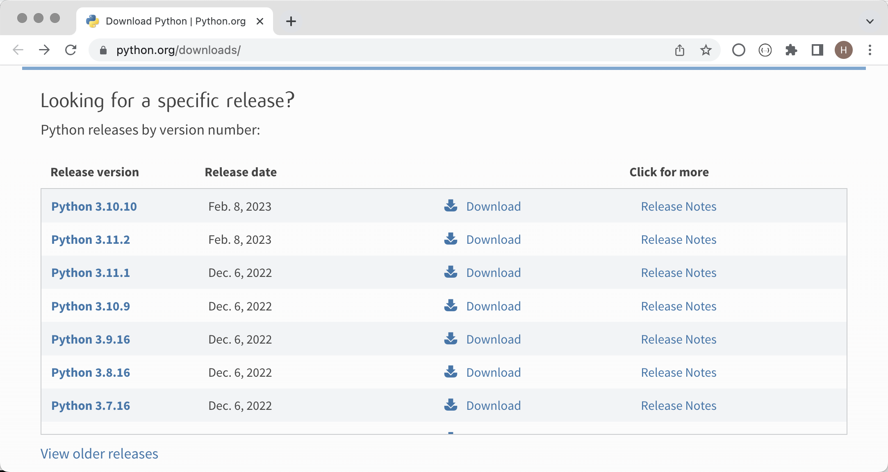

## History and Features of Python

#### History of Python

1. Christmas 1989: Guido von Rossum started writing a compiler for the Python language.
2. February 1991: The first Python compiler (also an interpreter) was born. It was implemented in C language (later) and could call C library functions. 
3. January 1994: Python 1.0 was officially released.
4. October 16, 2000: Python 2.0 is released, adding complete [garbage collection](https://zh.wikipedia.org/wiki/%E5%9E%83%E5%9C%BE%E5%9B%9E%E6%94%B6_(%E8%A8%88%E7%AE%97%E6%A9%9F%E7%A7%91%E5%AD%B8)) and providing support for [Unicode](https://zh.wikipedia.org/wiki/Unicode) . 
5. December 3, 2008: Python 3.0 was released. It is not fully compatible with previous Python codes. However, because many companies currently use Python 2.x versions in projects and operations, there are many new features in Python 3.x. Features were later ported to Python 2.6/2.7 versions.

#### Advantages and Disadvantages of Python

The Python language has many advantages. Let me briefly(简要的) list a few for you.

1. **Simple and elegant , Python** **is easier to get started** than many other programming languages .
2. You can do more things with less code and **improve development efficiency** .
3. Open source code, with **a strong community and ecosystem** .
4. **It can do a lot of things** and is extremely adaptable.
5. **A glue language** that can bind things developed in other languages.
6. Interpreted languages ​​are easier to **cross-platform** and can run on multiple operating systems.

The main disadvantage of Python is **low execution efficiency** (a common problem of interpreted languages). If you value code execution efficiency more, C, C++ or Go may be a better choice for you.


## Setting Up the Environment

### Installing Python Interpreter

official website 



```sh
DEV_HOME    = "dev_home"
PYTHON_PATH = %DEV_HOME%\path_to_python.exe_dir
PATH       += %PYTHON_PATH%                             # add PYTHON_PATH
```

