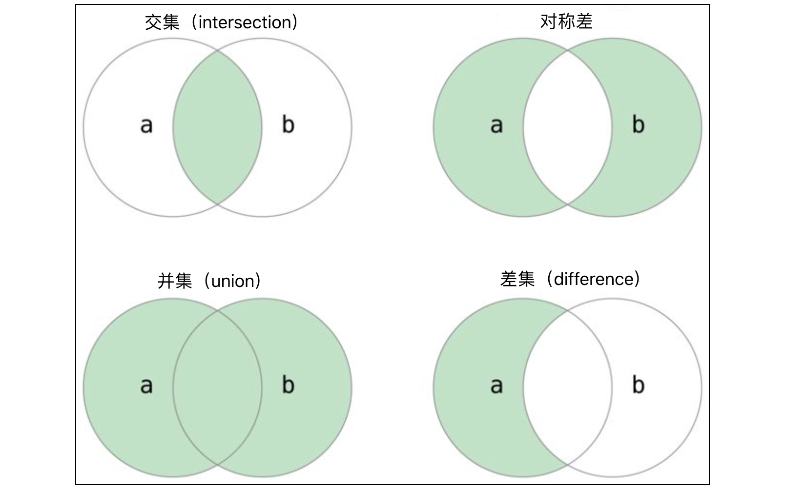

## 1 List

### 1.1 Create List

* list is a data sequence composed of **a series of elements** in **a specific order**, so we can use it to save multiple data.
* list is a mutable type, so you can add and remove element.

```python
"""
create
"""
list0 = []                 # empty list
list1 = [35, 12, 99, 68, 55, 35, 87]
list2 = ['Python', 'Java', 'Go', 'Kotlin']
list3 = [100, 12.3, 'Python', True]
print(list1)               # [35, 12, 99, 68, 55, 35, 87]
print(list2)               # ['Python', 'Java', 'Go', 'Kotlin']
print(list3)               # [100, 12.3, 'Python', True]
```

```python
"""
list comprehensions : create list by a simple way
"""
items = [i for i in range(1, 100) if i % 3 == 0 or i % 5 == 0]
print(items)

nums2 = [num ** 2 for num in [35, 12, 97, 64, 55]]
print(nums2)

nums2 = [num for num in [35, 12, 97, 64, 55] if num > 50]
print(nums2)
```

```python
"""
Nested lists :use list comprehensions to generate nested list
	five element , each element is a list which have three element.
"""
import random
scores = [[random.randrange(60, 101) for _ in range(3)] for _ in range(5)]
print(scores)
```

### 1.2 Use of List

```python
"""
list(obj)       : make other sequences turned into lists.
len(obj)        : get number of element in list.
range([num:]num): Traversal of elements
"""
list3 = []
list4 = list(range(1, 10))  # range() offen use to traversal
list5 = list('hello')
print(list3)                # []
print(list4)                # [1, 2, 3, 4, 5, 6, 7, 8, 9]
print(list5)                # ['h', 'e', 'l', 'l', 'o']
print(len(list3))           # 0
print(len(list4))           # 9
print(len(list5))           # 5

print("\r\nTraversal of elements:")
languages = ['Python', 'Java', 'C++', 'Kotlin']
print("\r\nTraversal of elements 1:")
for ele in languages:
    print("\t" + ele)
print("\r\nTraversal of elements 2:")
for index in range(len(languages)):
    print("\t" + languages[index])
```

```python
"""
`+`              splice two lists
`*`              repetition operations on lists.
`in` `not in`  determine whether an element is in the list
"""
items5 = [35, 12, 99, 45, 66]
items6 = [45, 58, 29]
items7 = ['Python', 'Java', 'JavaScript']

print("\r\nOperator + splice two lists:")
print(items5 + items6)  # [35, 12, 99, 45, 66, 45, 58, 29]
print(items6 + items7)  # [45, 58, 29, 'Python', 'Java', 'JavaScript']
items5 += items6
print(items5)  # [35, 12, 99, 45, 66, 45, 58, 29]

print("\r\nOperator * repetition:")
print(items6 * 3)  # [45, 58, 29, 45, 58, 29, 45, 58, 29]
print(items7 * 2)  # ['Python', 'Java', 'JavaScript', 'Python', 'Java', 'JavaScript']

print("\r\nOperator in determine whether an element is in the list:")
print(29 in items6)  # True
print(99 in items6)  # False
print('C++' not in items7)     # True
print('Python' not in items7)  # False
```

```python
"""
list[index]              index, index alse can be -1 to -N
list[start:end]          slicing operation, default stride is 1
list[start:end:stride]   slicing operation
"""
items8 = ['apple', 'waxberry', 'pitaya', 'peach', 'watermelon']
print("\r\nlist[index]:")
print(items8[0])   # apple
print(items8[2])   # pitaya
print(items8[4])   # watermelon
items8[2] = 'durian'
print(items8)      # ['apple', 'waxberry', 'durian', 'peach', 'watermelon']
print(items8[-5])  # 'apple'       

print("\r\nlist[start:end]:")
print(items8[1:3])     # ['strawberry', 'durian']
print(items8[:3:1])    # ['apple', 'strawberry', 'durian']
print(items8[::2])     # ['apple', 'durian', 'watermelon']
print(items8[-4:-2])   # ['strawberry', 'durian']
print(items8[-2::-1])  # ['peach', 'durian', 'strawberry', 'apple']
```

```python
"""
list operate:
	list.append(ele)        : adding elements to the end of the list
	list.insert(index, ele) : new elements at the specified index
	list.remove(ele)        : delete specified elements from the list
	list.pop()              : deletes the last element in the list by default
	list.pop(index)         : delete the element at the specified index. If not found, raise `IndexError`
	list.clear()            : clear the elements in the list
	del list[index]         : like list.pop(index)
"""
languages = ['Python', 'Java', 'C++']
print("\r\n append insert:")
languages.append('JavaScript')
print(languages)  # ['Python', 'Java', 'C++', 'JavaScript']
languages.insert(1, 'SQL')
print(languages)  # ['Python', 'SQL', 'Java', 'C++', 'JavaScript']

print("\r\n remove pop clear:")
languages = ['Python', 'SQL', 'Java', 'C++', 'JavaScript']
if 'Java' in languages:
    languages.remove('Java')
if 'Swift' in languages:
    languages.remove('Swift')
print(languages)  # ['Python', 'SQL', C++', 'JavaScript']
languages.pop()
temp = languages.pop(1)
print(temp)       # SQL
languages.append(temp)
print(languages)  # ['Python', C++', 'SQL']
languages.clear()
print(languages)  # []

print("\r\n del:")
items = ['Python', 'Java', 'C++']
del items[1]
print(items)  # ['Python', 'C++']
```

```python
"""
ele index and frequency:
	list.index(ele)        : find the index position of an element in the list. If not found, raise `ValueError`
	list.index(ele,index)  : find the index position of an element from specified index.
	list.count(ele)        : new elements at the specified index
"""
items = ['Python', 'Java', 'Java', 'C++', 'Kotlin', 'Python']
print(items.index('Python'))     # 0
# find 'Python' from index 1
print(items.index('Python', 1))  # 5
print(items.count('Python'))     # 2
print(items.count('Kotlin'))     # 1
print(items.count('Swfit'))      # 0
# find 'Java' from index 3
print(items.index('Java', 3))    # ValueError: 'Java' is not in list
```

```python
"""
Sort and reverse
	list.sort()     : sort by letter 
	list.reverse()
"""
items = ['Python', 'Java', 'C++', 'Kotlin', 'Swift']

print("\r\n sort reverse:")
items.sort()
print(items)  # ['C++', 'Java', 'Kotlin', 'Python', 'Swift']
items.reverse()
print(items)  # ['Swift', 'Python', 'Kotlin', 'Java', 'C++']
```

## 2 Tuple

* Tuple alse is a data sequence composed of **a series of elements** in **a specific order**, so we can use it to save multiple data.
* But tuple is a immutable type. Once a tuple is defined, elements cannot be added or deleted, elements cannot be modify.

```python 
"""
() or ,                 : create tuple
type(tuple)             : check type
len(tuple)              : get num of tuple elements 
tuple[index]            : get element by index
tuple[start:end]        : slicing operation, default stride is 1
tuple[start:end:stride] : slicing operation
"""
t1 = (35, 12, 98)
t2 = 35, 12, 98
t3 = ('echuan', 43, True, '四川成都')
t4 = ()
t5 = 'hello',    

print("\r\n type and len:")
print(type(t1))  # <class 'tuple'>
print(type(t2))  # <class 'tuple'>
print(type(t3))  # <class 'tuple'>
print(type(t4))  # <class 'tuple'>
print(type(t5))  # <class 'tuple'>
print(len(t1))  # 3
print(len(t2))  # 4
print(len(t3))  # 4
print(len(t4))  # 4
print(len(t5))  # 4

print("\r\n []:")
print(t1[0])    # 35
print(t1[2])    # 98
print(t2[-1])   # 四川成都
print(t2[:2])   # (35, 12)
print(t2[::3])  # (35,)
```

```python
"""
immutable tuple
package and unpackage
"""
# package  
print("\r\n package unpackage:")
a = 1, 10, 100
print(type(a))  # <class 'tuple'>
print(a)        # (1, 10, 100)

# unpackage
i, j, k = a
print(i, j, k)  # 1 10 100

# immutable
print("\r\n immutable:")
a[0] = 88888  # TypeError
```

```python
"""
* Traversal of elements
* + , in ,not in
"""
t1 = (35, 12, 98)
t3 = ('echuan', 43, True, '四川成都')
# Traversal of elements
for elem in t1:
    print(elem)

# operator in
print(12 in t1)         # True
print(99 in t1)         # False
print('Hao' not in t3)  # False

# operator +
t6 = t1 + t3
print(t6)  # (35, 12, 98, 'echuan', 43, True, '四川成都')
```

```python
"""
tuple and list convert to each other
"""
infos = ('apple', 'banana', 'orange')
print(list(infos))  # ['apple', 'banana', 'orange']

frts = ['apple', 'banana', 'orange']
print(tuple(frts))  # ('apple', 'banana', 'orange')
```

## 3 Strings

### 3.1 String Definition

The so-called **string** is **a limited sequence composed of zero or more characters** , generally recorded as: $$ s = a_1a_2 \cdots a_n ,,,,, (0 \le n \le \infty) $$In Python program , we can represent a string by surrounding **single or multiple characters** with **single or double quotes**. The characters in the string can be special symbols (such as: 💩, 🐷, 🀄️), etc.

```python
"""
	* single or multiple characters
	* single or double quotes
	* three single or double quotes can include multiple lines 
"""
s1 = 'hello, world!'
s2 = "你好，世界！❤️"
s3 = '''
hello,
wonderful
world!
'''
print(s1)
print(s2)
print(s3)    # multiple lines
```

```python
"""
escape character:
	some character itself has specified mean, such as `'` or `"`, use to represent string. if want string container it, it must be escaped.
	use backslash(`\`) to indicate escape:
		\<new line>   str still connect 
		\\            \\
		\'            '
		\"            "
		\n            New Line
		\r            Carriage Return
		\t            Tab
		\b            Backspace
		\ooo          Octal value, o is ortal number,from 0 to 7
		\ xhh         Hex value, h is hexadecimal number, from 0 to F 
"""
s = 'This string will not include \
backslashes or newline characters.'
print(s)                     # This string will not include backslashes or newline characters.

s='The \\character is called backslash'
print(s)                     # The \character is called backslash

s='Hello \'Python\"'
print(s)                     # Hello 'Python"

s='Hel\blo'
print(s)                     # Helo

s='Hello\nPython'
print(s)                     # Hello<New Line>Python

s='Hello\tPython'
print(s)                     # Hello	Python

s="\141"
print(s)                     # OCT 141 is 64 + 32 + 1 = 97 Decimal , the ASCII value is a

s="\x41"
print (s)                    # Hex 41 is 4 * 16 + 1 = 65 Decimal, the ASCII value is A

s="中文"
unicode_str = s.encode('unicode_escape').decode('utf-8')
print(unicode_str)        # \u4e2d\u6587
s = '\u4e2d\u6587'
print(s)                  # 中文
```

```python
"""
raw string:
	Start with `r` or `R`.
	every character in the string has its original meaning without so-called escape characters
"""
s = r'This string will not include \
backslashes or newline characters.'
print(s)                     # This string will not include \<New Line>backslashes or newline characters.

s=r'The \\character is called backslash'
print(s)                     # The \\character is called backslash

s=R'Hello \'Python\"'
print(s)                     # Hello \'Python\"

s=R'Hello\nPython'
print(s)                     # Hello\nPython

s=R"\141"
print(s)                     # \141

s=R"\x41"
print (s)                    # \x41
```

### 3.2 String Operations

The Python language provides a very rich set of operators for string types, many of which have similar functions to list type operators. 
For example:
* use `+`operators to concatenate strings
* use `*`operators to repeat the content of a string
* use `in`and `not in`to determine whether a string contains another string
* use the `[]`and `[:]`operator to convert characters from 
* Remove a certain character or certain string from the string.

```python
"""
len(str) : obtaining the number of list elements
str(obj) : convert other to string
"""
print(len('goodbye, world'))  # 14
print(str(list(range(5))))
print(str(True))
print(str(100.001))
```

```python
"""
 `+`AND `*`operator to concatenate and repeat strings
"""
s1 = 'hello' + ', ' + 'world'
print(s1)    # hello, world
s2 = '!' * 3
print(s2)    # !!!
s1 += s2
print(s1)    # hello, world!!!
s1 *= 2
print(s1)    # hello, world!!!hello, world!!!
```

```python
"""
Indexing and slicing
	str[index] 
	str[start:stop:step]
"""
s = 'abc123456'
n = len(s)
print(s[0], s[-n])    # a a
print(s[n-1], s[-1])  # 6 6
print(s[2], s[-7])    # c c
print(s[5], s[-4])    # 3 3
print(s[2:5])         # c12
print(s[-7:-4])       # c12
print(s[2:])          # c123456
print(s[:2])          # ab
print(s[::2])         # ac246
print(s[::-1])        # 654321cba
```

```python
"""
comparison string:
	the string is compared to the size of the encoding corresponding to each character.
"""
s1 = 'a whole new world'
s2 = 'hello world'
print(s1 == s2)             # False
print(s1 < s2)              # True
print(s1 == 'hello world')  # False
print(s2 == 'hello world')  # True
print(s2 != 'Hello world')  # True
s3 = '三毛'
print(ord('三'))            # 19977
print(ord('毛'))            # 27611
s4 = 'フェイ'
print(ord('フ'))            # 12501
print(ord('ェ'))            # 12455
print(ord('イ'))            # 12452
print(s3 >= s4)             # True
print(s3 != s4)             # True
```


```python
"""
Travalsel String Character
"""
s = 'hello'
print("\r\nfor_in string by element:")
for elem in s:
    print(elem)
print("\r\nfor_in string by index:")
for i in range(len(s)):
    print(s[i])
```

### 3.3 String Methods

* Case related operations
* Find operation
* Judgment of nature
* Format string
* pruning operation
* Replacement operation
* Split and merge
* encoding and decoding
* Other methods

```python
"""
Case related operations, won't affect the original string
	str.capitalize() : Upper First Character
	str.title()      : Upper First Character of Each Word
	str.upper()      : Upper String
	str.lower()      : Lower String
"""
s1 = 'hello, man. hello, world!'
# Upper First Characher
print(s1.capitalize())  # Hello, man. hello, world!
# Upper First Character of Each Word
print(s1.title())       # Hello, Man. Hello, World!
# Upper String
print(s1.upper())       # HELLO, MAN. HELLO, WORLD!
s2 = 'GOODBYE'
# Lower String
print(s2.lower())       # goodbye
# operation not affect the original string 
print(s1)               # hello, man. hello, world!
print(s2)               # GOODBYE
```

```python
"""
Find operation
	str.find(f_str[, index]), return index. if not found, return -1
	str.index(f_str[, index]), return index. if not found, raise `ValueError`
"""
s = 'hello, world!'
print(s.find('or'))      # 8
print(s.find('or', 9))   # -1
print(s.find('of'))      # -1
print(s.index('or'))     # 8
print(s.index('or', 9))  # ValueError: substring not found
```

```python
"""
Judgment of nature
	str.startswith(s_str)  : return Ture or False
	str.endswith(e_str)    : return Ture or False
	str.isdigit()          : return Ture or False, determine whether is completely composed of numbers
	str.isalpha()          : return Ture or False, determine whether is completely composed of letters
	str.isalnum()          : return Ture or False, determine whether is made up of letters and numbers
"""
s1 = 'hello, world!'
print(s1.startswith('He'))   # False
print(s1.startswith('hel'))  # True
print(s1.endswith('!'))      # True
s2 = 'abc123456'
s2 = 'abc'
print(s2.isdigit())  # False
print(s2.isalpha())  # False
print(s3.isalpha())  # True
print(s2.isalnum())  # True
```

```python
"""
Format string
"""
s = 'hello, world'
print(s.center(20, '*'))  # ****hello, world****
print(s.rjust(20))        #         hello, world
print(s.ljust(20, '~'))   # hello, world~~~~~~~~
print('33'.zfill(5))      # 00033
print('-33'.zfill(5))     # -0033
a = 321
b = 123
print(f'{str(a).zfill(5)} * {str(b).zfill(5)} = {a * b}')     # 00321 * 00123 = 39483
```

```python
"""
pruning operation
"""
s1 = '   test@126.com  '
print(s1.strip())           # test@126.com
s2 = '~hello, world~'     
print(s2.lstrip('~'))       # hello, world~
print(s2.rstrip('~'))       # ~hello, world
```

```python
"""
Replacement operation
	str.replace(substr, replace_str[, replace_times])
"""
s = 'hello, good world'
print(s.replace('o', '@'))     # hell@, g@@d w@rld
print(s.replace('o', '@', 2))  # hell@, g@od world
```

```python
"""
Split and merge
	str.split()
	delimiter_str.join(str)
"""
s = 'I love you'
words = s.split()
print(words)            # ['I', 'love', 'you']
print('~'.join(words))  # I~love~you
```

```python
"""
encoding and decoding
"""
a = 'AEC中文フェイ'
b = a.encode('utf-8')
c = a.encode('gbk')
print(b)                  # b'AEC\xe4\xb8\xad\xe6\x96\x87\xe3\x83\x95\xe3\x82\xa7\xe3\x82\xa4'
print(c)                  # b'AEC\xd6\xd0\xce\xc4\xa5\xd5\xa5\xa7\xa5\xa4'
print(b.decode('utf-8'))  # AEC中文フェイ
print(c.decode('gbk'))    # AEC中文フェイ
```

regular expressions in subsequent courses

## 4 Sets

set is an **unordered** collection with **no duplicate elements**

### 4.1 Create Sets

```python
"""
	empty set     : only use `set()`, not Curly braces(`{}`)
	not empty set ：use `set()` or Curly braces(`{}`)
		set(string) will use letters as elements
"""
empty_set = set()
print(empty_set)       # set()
set1 = {'apple', 'orange', 'apple', 'pear', 'orange', 'banana'}
print(set1)            # {'orange', 'banana', 'pear', 'apple'}
set2 = set(['apple', 'orange', 'apple', 'pear', 'orange', 'banana'])
print(set2)            # {'orange', 'banana', 'pear', 'apple'}
set2 = set('abracadabra')
print(set2)            # {'a', 'r', 'b', 'c', 'd'}
```

```python
"""
	set comprehensions  
"""
a = {x for x in 'abracadabra' if x not in 'abc'}
print(a)      # {'d', 'r'}
```

### 4.2 Set operations

```python
"""
collection methods
	set.add(ele)     : add element
	set.discard(ele) : try to remove element. if not exists, no error be raise.  
	set.remove(ele)  : remove element. if not exists, raise `KeyError`
	set.clear()      : clear element
"""
set1 = {1, 10, 100}

set1.add(1000)
set1.add(10000)
print(set1)  # {1, 100, 1000, 10, 10000}

set1.discard(10)
if 100 in set1:
    set1.remove(100)
print(set1)  # {1, 1000, 10000}

set1.clear()
print(set1)  # set()
```

```python
"""
 `in` or `not in`
"""
set1 = {11, 12, 13, 14, 15}
print(10 in set1)      # False 
print(15 in set1)      # True
set2 = {'Python', 'Java', 'C++', 'Swift'}
print('Ruby' in set2)  # False
print('Java' in set2)  # True
```



```python
"""
	a intersection b           : elements in a but not in b
	a union b                  : elements in a or b or both
	a difference b             : elements in both a and b
	a symmetric difference b   : elements in a or b but not both
"""
set1 = {1, 2, 3, 4, 5, 6, 7}
set2 = {2, 4, 6, 8, 10}

# intersection
print(set1 & set2)                      # {2, 4, 6}
print(set1.intersection(set2))          # {2, 4, 6}

# union
print(set1 | set2)                      # {1, 2, 3, 4, 5, 6, 7, 8, 10}
print(set1.union(set2))                 # {1, 2, 3, 4, 5, 6, 7, 8, 10}

# difference
print(set1 - set2)                      # {1, 3, 5, 7}
print(set1.difference(set2))            # {1, 3, 5, 7}

# Symmetric difference
print(set1 ^ set2)                      # {1, 3, 5, 7, 8, 10}
print(set1.symmetric_difference(set2))  # {1, 3, 5, 7, 8, 10}

set1 = {1, 3, 5, 7}
set2 = {2, 4, 6}
set1 |= set2
print(set1)  # {1, 2, 3, 4, 5, 6, 7}
set3 = {3, 6, 9}
set1 &= set3
print(set1)  # {3, 6}
set2 -= set1
print(set2)  # {2, 4}
```

```python
"""
comparison operation
	==    : If the elements in the two sets are exactly the same
	a.issubset(b) 
	b.issuperset(a) : determine whether a is subset of a
	a.isdisjoint(b) : determine whether a and b have the same elements
"""
set1 = {1, 3, 5}
set2 = {1, 2, 3, 4, 5}
set3 = {5, 4, 3, 2, 1}
set4 = {7, 8, 9}

print(set2 == set3)           # True
print(set1.issubset(set2))    # True
print(set2.issuperset(set1))  # True
print(set1.isdisjoint(set2))  # True
print(set1.isdisjoint(set4))  # False
```

## 5 Dictionary


#### 5.4 集合

```python


# 集合元素的存在性判断
>>> 'orange' in basket 
True
>>> 'crabgrass' in basket
False

# 集合与字符串
>>> a = set('abracadabra')
>>> b = set('alacazam')
>>> a                                  # unique letters in a
{'a', 'r', 'b', 'c', 'd'}

# 集合运算
>>> a - b                              # letters in a but not in b
{'r', 'd', 'b'}
>>> a | b                              # letters in a or b or both
{'a', 'c', 'r', 'd', 'b', 'm', 'z', 'l'}
>>> a & b                              # letters in both a and b
{'a', 'c'}
>>> a ^ b                              # letters in a or b but not both
{'r', 'd', 'b', 'm', 'z', 'l'}

# 集合也支持推导式
>>> a = {x for x in 'abracadabra' if x not in 'abc'}
>>> a
{'r', 'd'}
```

#### 5.5 字典
```python
# 字典定义  ： kv对
tel = {'jack': 4098, 'sape': 4139}
>>> tel['guido'] = 4127
>>> tel
{'jack': 4098, 'sape': 4139, 'guido': 4127}

# kv对的序列 创建字典
>>> dict([('sape', 4139), ('guido', 4127), ('jack', 4098)])

# 字典推导式
>>> {x: x**2 for x in (2, 4, 6)}
{2: 4, 4: 16, 6: 36}
```
#### 5.6 遍历
```python
# 字典遍历 ： items() 
knights = {'gallahad': 'the pure', 'robin': 'the brave'}
for k, v in knights.items():
    print(k, v)

for i in 

# 序列遍历 ： enumerate() 可以同时取出位置索引和对应的值
for i, v in enumerate(['tic', 'tac', 'toe']):
    print(i, v)

# 同时循环两个或多个序列 : zip(x1, x2, x3, ...)
questions = ['name', 'quest', 'favorite color']
answers = ['lancelot', 'the holy grail', 'blue']
for q, a in zip(questions, answers):
    print('What is your {0}?  It is {1}.'.format(q, a))

# 逆向遍历序列 ： reversed()
for i in reversed(range(1, 10, 2)):
    print(i)  # 9, 7, 5, 3, 1

# 排序sorted & 去重set
basket = ['apple', 'orange', 'apple', 'pear', 'orange', 'banana']
for i in sorted(basket):
    print(i)

for f in sorted(set(basket)):
    print(f)
```
#### 5.7 比较
```python
# 比较运算符
  `in` 和 `not in` 用于执行确定一个值是否存在于某个容器中的成员检测
  `is` 和 `is not` 用于比较两个对象是否是同一个对象
  `a < b == c`  链式操作:校验 `a` 是否小于 `b`，且 `b` 是否等于 `c`
  可以用布尔运算符 `and` 和 `or` 组合

序列比较按字典顺序。字典式顺序使用 Unicode 码位序号排序单个字符。
  (1, 2, 3)              < (1, 2, 4)
  [1, 2, 3]              < [1, 2, 4]
  'ABC' < 'C' < 'Pascal' < 'Python'
```

##### 字符串
```python
#　用单引号（`'……'`）或双引号（`"……"`）标注的结果相同
'spam ' + 'eggs'  # 'spam eggs'
'doesn\'t'        # "doesn't"

# 会省略两边引号
>>> '"Isn\'t," they said.'
'"Isn\'t," they said.'
>>> print('"Isn\'t," they said.')
"Isn't," they said.

# 不转义
>>> print('C:\some\name')  # here \n means newline!
C:\some
ame
>>> print(r'C:\some\name')  # note the r before the quote
C:\some\name

# 多行  同scala
print("""\
Usage: thingy [OPTIONS]
     -h                        Display this usage message
     -H hostname               Hostname to connect to
""")

# 字面值自动拼接
text = ('Put several strings within parentheses '
        'to have them joined together.')
text
'Put several strings within parentheses to have them joined together.'
# 字符串最快拼接
test = f"{str1}{str2} "

# 字符串拆分成list
str.split("|")

# 字符串的索引
>>> word = 'Python'
>>> word[0]  # character in index 0
'P'
>>> word[-2]  # second-last character
'o'

# 切片索引 ： 省略开始索引时，默认值为 0，省略结束索引时，默认为到字符串的结尾
# 切片会自动处理越界索引
>>> word[:2]   # character from the beginning to index 2 (excluded)
'Py'
>>> word[4:]   # characters from index 4 (included) to the end
'on'
>>> word[-2:]  # characters from the second-last (included) to the end
'on'

# 内置函数 `len()` 返回字符串的长度

# 是否包含 in
"ad" in "admin"             # True

# strip( char )  删除两端的char，无参默认删空格
",2020,2021,,,,".strip(',')    # 2020,2021

```
### 4、函数

#### 1 函数概述

```python
# 函数 def 定义，函数体必须缩进
def fib(n):    # 斐波那契数列
    a, b = 0, 1
    while a < n:
        print(a, end=' ')
        a, b = b, a+b
    return result   # return 返回值

# 函数传参
fib(20)

# 函数作为参数传递
f = fib
f(20)

# 没有 return 语句的函数也返回值，是 None
def a(n):
	n = n + 1
print(a(1)) # None
```

#### 4.2 函数的参数

```python
# 参数设置默认值，传参时可以不传有默认值的参数
def ask_ok(prompt, retries=4, reminder='Please try again!'):
	pass
ask_ok('Do')
ask_ok('OK', 2)
ask_ok('OK', 2, 'Come on')


# 默认值只计算一次
i = 5
def f(arg=i):
    print(arg)
i = 6
f()    # 5

# 默认值为列表、字典或类实例等可变对象时，会保留计算过的值
def f(a, L=[]):
    L.append(a)
    return L

print(f(1))  # [1]
print(f(2))  # [1, 2]
print(f(3))  # [1, 2, 3]

# 可变数量的实参, 有若干个普通参数
def write_multiple_items(file, separator, *args):
    file.write(separator.join(args))

# 字典作为参数
def test(**input_dict):
	for k, v in input_dict.items():
	    print(k, v)

# 位置限制参数，/ 前后位置不能变
def foo(name, /, **kwds):
   return 'name' in kwds

# 实名限制传参， * 必须指定变量名才能传参
def kwd_only_arg(*, arg):
    print(arg)
kwd_only_arg(arg=3)  # 必须这么传
```
#### 4.3 函数作为参数，返回值

```python
import time as t
# 函数 func 作为参数传入，time_record函数，用来计算func的计算时间
def time_record(func, n, a, x): 
    start = t.perf_counter_ns()
    func(n,a,x)
    end = t.perf_counter_ns()
    time_spend = end - start
    return print(time_spend)
    
def mutinomial(n,a,x):
    p = 0
    for i in range(0,n+1):
        p += a[i]*pow(x,i)
    return print(p)

def qinjiushao(n,a,x):
    p = a[n]
    for i in range(n,0,-1):
        p *= x
        p += a[i-1]
    return print(p)

if __name__ == '__main__':
    n = 3
    a = [2,1,3,4]
    x = 2.2

    time_record(mutinomial,n,a,x)
    time_record(qinjiushao,n,a,x)

# 函数作为返回值
def lazy_sum(*args):
    def sum():
        ax=0
        for n in args:
        　　ax = ax + n
        return ax
    return sum

f = lazy_sum(1,2,3,4,5)
print f    # <function sum at 0x02657770>
	# lazy_sum(1,2,3,4,5)返回的是一个指向求和的函数的函数名。
	# 在调用lazy_sum(1,2,3,4,5)的时候，不立刻求和，而是根据后面代码的需要在计算。
print f()   # 15   用f()调用求和函数，计算出结果。

f1 = lazy_sum(1,2,3,4,5,6)
f2 = lazy_sum(1,2,3,4,5,6)
print f1 == f2    # False  每次调用，都返回一个新的函数对象。

# 闭包中局部变量的使用
def count():
　　fs = []
　　for i in range(1,4):
　　　　def f():
　　　　　　return i*i  
　　　　fs.append(f)
　　return fs      # 返回的fs中的元素f函数引用了变量i，不是闭包，所以会发生改变
f1, f2, f3 = count() 
print f1()   # 9
print f2()   # 9
print f3()   # 9
```

#### 4.4 lambda函数
语法上，匿名函数只能是单个表达式。语义上，它只是常规函数定义的语法糖。
```python
# lambda 表达式 作为返回值
def make_incrementor(n):
    return lambda x: x + n
plusFive = make_incrementor(5)  # plusFive = lambda x: x+5
print(plusFive(4))              # 9

# lambda 表达式的函数体最好只写单行

# lambda 表达式 作为参数
pairs = [(1, 'one'), (2, 'two'), (3, 'three'), (4, 'four')]
pairs.sort(key=lambda pair: pair[1])    # 排序键为第二列
pairs # [(4, 'four'), (1, 'one'), (3, 'three'), (2, 'two')]
```

## 6、module & package

模块是包含 Python 定义和语句的文件。就是工具python文件
import 语句 _第一次_ 遇到模块名时执行

#### 6.1 基本导入

```python
# Fibonacci numbers module NAMED fibo.py
def fib(n):    # write Fibonacci series up to n
    a, b = 0, 1
    while a < n:
        print(a, end=' ')
        a, b = b, a+b
    print()
```

```python
# 其他文件使用 fibo.py 中定义的语句
>>> import fibo
>>> fibo.fib(1000)
0 1 1 2 3 5 8 13 21 34 55 89 144 233 377 610 987

>>> fibo.__name__
'fibo'
```

#### 6.2 部分导入& 重命名
```python
>>> from fibo import fib
>>> fib(500)
0 1 1 2 3 5 8 13 21 34 55 89 144 233 377

>>> import fibo as fib
>>> fib.fib(500)
0 1 1 2 3 5 8 13 21 34 55 89 144 233 377

>>> from fibo import fib as fibonacci
>>> fibonacci(500)
0 1 1 2 3 5 8 13 21 34 55 89 144 233 377
```

#### 6.3 脚本执行模块
```python
# 执行
python fibo.py <arguments>

# 执行了module中的这部分内容
if __name__ == "__main__":
    import sys
    fib(int(sys.argv[1]))
```
#### 6.4 dir()函数
函数列出所有类型的名称：变量、模块、函数等
```python
>>> import fibo
>>> dir(fibo)
['__name__', 'fib', 'fib2']
```
#### 6.5 包
```python
# 包类似于 Java Package 
from sound.effects import echo  # 导入包里的模块
from sound.effects.echo import echofilter  # 导入模块里的函数
```

## 7、输入输出格式化

### 7.1 格式化字符串
```python
# 变量格式化输出字符串,在字符串开头的引号/三引号前添加 `f` 或 `F`
# 控制长度，小数长度，添加其余字符 {变量:整数长度.小数长度[其余字符]}
>>> year = 2016
>>> event = 'Referendum'
>>> f'Results of the {year:10} {event:15}'
'Results of the 2016       Referendum     '

# 0填充  zfill(含符号和小数点的总长度)
>>> '12'.zfill(5)
'00012'
>>> '-3.14'.zfill(7)
'-003.14'

#  格式化字符串 str.format() 
>>> yes_votes = 42_572_654
>>> no_votes = 43_132_495
>>> percentage = yes_votes / (yes_votes + no_votes)
>>> '{:-9} YES votes  {:2.2%}'.format(yes_votes, percentage)
' 42572654 YES votes  49.67%'
# str.format() 格式化字面值
>>> import math
>>> print(f'The value of pi is approximately {math.pi:.3f}.')
The value of pi is approximately 3.142.
# str.format() 控制位置
>>> print('{0} and {1}'.format('spam', 'eggs'))
spam and eggs
>>> print('{1} and {0}'.format('spam', 'eggs'))
eggs and spam

# 直接变成字符串
>>> s = 'Hello, world.'
>>> str(s)
'Hello, world.'
>>> repr(s)
"'Hello, world.'"
>>> str(1/7)
'0.14285714285714285'
```

```python
# 字典格式化
>>> table = {'Sjoerd': 4127, 'Jack': 4098, 'Dcab': 8637678}
>>> print('Jack: {Jack:d}; Sjoerd: {Sjoerd:d}; Dcab: {Dcab:d}'.format(**table))
Jack: 4098; Sjoerd: 4127; Dcab: 8637678
```

### 7.2 读写文件
```python
# 读文件  open() 返回一个 file object
# with open(filename, mode, encoding=None)
	# with : 即使发生异常文档也能正常关闭，没有要使用f.close()关闭文档
	# mode : w 只写入  a 打开文件追加  r+ 进行读写  省略 r 只读
	#        b 以二进制模式读取： 如 wb rb rb+
	# encoding 建议 "utf-8"
with open('workfile', encoding="utf-8") as f:
    read_data = f.read()

# f.read(size)   size 个字符（文本）或 size 个字节（二进制）
# f.readline()  读一行
# f.write(string or binary)  写入字符串
```
### 7.3 json读写
json 相对于普通text，可以区分数字类型
```python
# JSON文件必须以UTF-8编码
>>> import json
>>> x = [1, 'simple', 'list']
>>> json.dumps(x)       # 将json对象序列化保存为 text file
'[1, "simple", "list"]' 
```
## 8、异常

### 8.1 异常处理
```python
import sys
try:
    f = open('myfile.txt')
    s = f.readline()
    i = int(s.strip())
except OSError as err:
    print("OS error:", err)
except ValueError:
    print("Could not convert data to an integer.")
except Exception as err:
    print(f"Unexpected {err=}, {type(err)=}")
    raise
finally:
    print('Goodbye, world!')  # finally 同 Java
```
### 8.2 主动出发异常
```python
# 向上传递异常
def func():
    raise ConnectionError 
    
try:
    func()
except ConnectionError as exc:
    raise RuntimeError('Failed to open database') from exc
```
## 9、类
### 9.1 作用域和命名空间
```python
# nonlocal & global
def scope_test():
    def do_local():
        spam = "local spam"

    def do_nonlocal():
        nonlocal spam
        spam = "nonlocal spam"

    def do_global():
        global spam
        spam = "global spam"

    spam = "test spam"
    do_local()                             # 普通的不会改变对象
    print("After local assignment:", spam) # test spam
    do_nonlocal()                          # nonlocal 会改变对象
    print("After nonlocal assignment:", spam) # nonlocal span
    do_global()                            # global 会改变全局对象，作用域中有时不会影响
    print("After global assignment:", spam) # nonlocal spam

scope_test()
print("In global scope:", spam)  # global spam
```
### 9.2 类定义
```python
# MyClass.i & MyClass.f 可以引用或赋值
class MyClass:
    """A simple example class"""   # Myclass.__doc__
    i = 12345
    def f(self):
        return 'hello world'
    def __init__(self, realpart, imagpart):  # 对象定义方法
        self.r = realpart
        self.i = imagpart

# 创建对象
x = MyClass(1,2)


# 方法的第一个参数常常被命名为 `self`。 这是一个约定
class Dog:
    def __init__(self, name):
        self.name = name
        self.tricks = []    # create empty list for each dog
    def add_trick(self, trick):
        self.tricks.append(trick)

>>> d = Dog('Fido')
>>> e = Dog('Buddy')
>>> d.add_trick('roll over')
>>> e.add_trick('play dead')
>>> d.tricks
['roll over']
>>> e.tricks
['play dead']
```
### 9.3 数据类
```python
# dataclass 注解
from dataclasses import dataclass

@dataclass
class Employee:
    name: str
    dept: str
    salary: int

>>>

>>> john = Employee('john', 'computer lab', 1000)
>>> john.dept
'computer lab'
>>> john.salary
1000
```
### 9.4 继承
```python
# 继承
class DerivedClassName(modname.BaseClassName):
	pass

# 多继承
class DerivedClassName(Base1, Base2, Base3):
    <statement-1>
```
### 9.5 变量
```python
# 自定义私有变量  __变量名  在类里会自动变为 _ClassName__变量名
# MappingSubclass 使用 update() 就是自己的方法，使用 __init__就是Mapping的updata()方法
class Mapping:
    def __init__(self, iterable):
        self.items_list = []
        self.__update(iterable)
    def update(self, iterable):
        for item in iterable:
            self.items_list.append(item)
    __update = update   # private copy of original update()

class MappingSubclass(Mapping):

    def update(self, keys, values):
        # provides new signature for update()
        # but does not break __init__()
        for item in zip(keys, values):
            self.items_list.append(item)
```
### 9.6 迭代器 & 生成器
```python
#  for in 遍历底层调用的都是迭代器，需要用的时候官网
for element in [1, 2, 3]:
    print(element)
for element in (1, 2, 3):
    print(element)
for key in {'one':1, 'two':2}:
    print(key)
for char in "123":
    print(char)
for line in open("myfile.txt"):
    print(line, end='')

# 迭代器 iterator : 
mytuple = ("apple","banana","cherry")
myit = iter(mytuple)                # iter() 将 元组变成一个迭代器
print(next(myit))                   # 使用 next() 可以一致访问迭代器的下一个元素
print(next(myit))
print(next(myit))
print(next(myit))                   # 报错

# 迭代器遍历
myit = iter(("apple","banana","cherry"))
for i in myit:
	print(i)

# 返回有限元素的迭代器元素个数，最快的方法
len(list(myit))

# 生成器 yield ，用于返回一个迭代器
def reverse(data):
    for index in range(data, -1, -1):
        yield index                       
# 使用推导式实现上述 reverse(data)
lambda x : (yield data[index] for index in range(len(x) -1 , -1, -1))

for char in reverse('golf'):
    print(char)  # f l o g

# 生成器表达式   类似列表推导式，只是由()包含，一般直接用于外部函数
sum(i*i for i in range(10))               # sum 285
data = 'golf'
list(data[i] for i in range(len(data)-1, -1, -1)) # ['f', 'l', 'o', 'g']
```
## 10、python 标准库
### 10.1 os & shutil 模块
```python
# os 模块，与操作系统交互
>>>import os
>>> os.getcwd()      # current working directory
'C:\\Python311'
>>> os.chdir('/server/accesslogs')   # Change working directory
>>> os.system('mkdir today')   #  mkdir in the system shell
0
>>> dir(os)
<returns a list of all module functions>
>>> help(os)
<returns an extensive manual page created from the module's docstrings>

# shutil 更高级的处理日常文件和目录管理任务
>>> import shutil
>>> shutil.copyfile('data.db', 'archive.db')
'archive.db'
>>> shutil.move('/build/executables', 'installdir')
'installdir'
```
### 10.2 glob 文件通配符
```python
# 在目录中使用通配符搜索创建文件列表
>>> import glob
>>> glob.glob('*.py') 
['primes.py', 'random.py', 'quote.py']
```
### 10.3 sys & [argparse](https://docs.python.org/3/howto/argparse.html) 处理命令行参数
```python
# 命令行参数作为列表存储在 sys 模块的 _argv_ 属性中
>>> import sys
>>> print(sys.argv)  
['demo.py', 'one', 'two', 'three']

# argparse 处理命令行参数
import argparse
parser = argparse.ArgumentParser(
    prog='top',
    description='Show top lines from each file')
parser.add_argument('filenames', nargs='+')
parser.add_argument('-l', '--lines', type=int, default=10)
args = parser.parse_args()
print(args)

# python top.py --lines=5 alpha.txt beta.txt
# args.lines 设为 5
# args.filenames 设为 ['alpha.txt', 'beta.txt']
```
### 10.4 [re](https://docs.python.org/zh-cn/3.11/library/re.html#module-re) 正则表达式工具
```python
>>> import re
>>> re.findall(r'\bf[a-z]*', 'which foot or hand fell fastest')
['foot', 'fell', 'fastest']
>>> re.sub(r'(\b[a-z]+) \1', r'\1', 'cat in the the hat')
'cat in the hat'
```
### 10.5 math & random & statistics
```python
# math 数学函数，cos log 等
import math
math.cos(math.pi / 4)

# random 随机选择
>>> import random
>>> random.choice(['apple', 'pear', 'banana'])  # 多选一
'apple'
>>> random.sample(range(100), 10)   # 随机抽10个数
[30, 83, 16, 4, 8, 81, 41, 50, 18, 33]
>>> random.random()                 # 随机 0 - 1小数
0.17970987693706186
>>> random.randrange(6)             # 固定范围随机整数
4

# statistics  基本统计属性（均值，中位数，方差等）
>>> import statistics
>>> data = [2.75, 1.75, 1.25, 0.25, 0.5, 1.25, 3.5]
>>> statistics.mean(data)   # 均值
1.6071428571428572
>>> statistics.median(data)  
1.25
>>> statistics.variance(data)
1.3720238095238095
```
### 10.6 互联网访问
 [`urllib.request`](https://docs.python.org/zh-cn/3.11/library/urllib.request.html#module-urllib.request "urllib.request: Extensible library for opening URLs.") 用于从URL检索数据
 [`smtplib`](https://docs.python.org/zh-cn/3.11/library/smtplib.html#module-smtplib "smtplib: SMTP protocol client (requires sockets).") 用于发送邮件

### 10.7 时间日期
```python
# datetime 模块提供了以简单和复杂的方式操作日期和时间的类
>>> from datetime import date
>>> now = date.today()
>>> now
datetime.date(2003, 12, 2)
>>> now.strftime("%m-%d-%y. %d %b %Y is a %A on the %d day of %B.")
'12-02-03. 02 Dec 2003 is a Tuesday on the 02 day of December.'

>>> # dates support calendar arithmetic
>>> birthday = date(1964, 7, 31)
>>> age = now - birthday
>>> age.days
14368
```

```python
import datetime as dt
######################################## date形式天数差
d1 = '2019-07-26'
d2 = '2020-08-01'
######## 法1
# （1）字符串-->时间格式date
date1 = dt.datetime.strptime(d1, "%Y-%m-%d").date()  ##datetime.date(2018, 1, 6)
print(date1)

#  (2) date 加减
date2 = date1 - dt.timedelta(days=1)
print(date2)
```


## 11、Python脚本
#### 11.1 可执行脚本
* 在BSD等类Unix系统上，Python脚本可以直接执行，就像shell脚本一样
```python
#!/usr/bin/env python3.5
```
使用 **chmod** 命令为脚本提供可执行模式或权限。
```shell
chmod +x myscript.py
```

#### 11.3 定制模块
Python提供了两个钩子来让你自定义它：`sitecustomize` 和 `usercustomize`。要查看其工作原理，首先需要找到用户site-packages目录的位置。
```python
>>> import site
>>> site.getusersitepackages()
'/home/user/.local/lib/python3.5/site-packages'
```
您可以在该目录中创建一个名为 `usercustomize.py` 的文件，并将所需内容放入其中。它会影响Python的每次启动，除非它以 [`-s`](https://docs.python.org/zh-cn/3.11/using/cmdline.html#cmdoption-s) 选项启动，以禁用自动导入。

`sitecustomize` 以相同的方式工作，但通常由计算机管理员在全局 site-packages 目录中创建，并在 `usercustomize` 之前被导入。有关详情请参阅 [`site`](https://docs.python.org/zh-cn/3.11/library/site.html#module-site "site: Module responsible for site-specific configuration.") 模块的文档。

## 12、关键字

### assert Keyword
```python
x = "hello"  
#if condition returns True, then nothing happens:  
assert x == "hello"  
#if condition returns False, AssertionError is raised:  
assert x == "goodbye"
```

