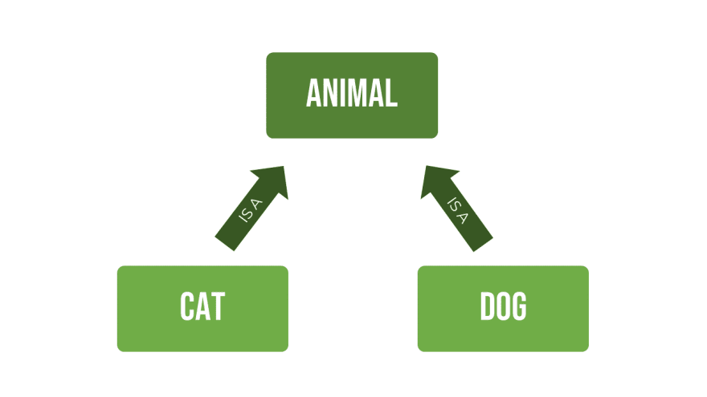

## 1 OOP

### 1.1 Define class and use

```python
"""
define class 
__init__  : used to init when creat instances
"""
class Student(object):
	"""A simple student class"""   # Myclass.__doc__
	
	identity = "student"           # Class variable

    # init : bind two attributes: name and age
    # first parameter is self
    def __init__(self, name, age):   
        self.name = name
        self.age = age

    def study(self, course_name):
        print('%s is learning %s.' % (self.name, course_name))

    def watch_movie(self):
        if self.age < 18:
            print('%s is watching movie.' % self.name)
        else:
            print('%s is watching cartoon.' % self.name)
```

```python
"""
use class create instance
"""
def main():
    stu1 = Student('echuan', 38)    # create student instance
    # stu do study job
    stu1.study('Python Design')
    # stu do watch movie job
    stu1.watch_movie()
    stu2 = Student('echo', 15)
    stu2.study('Mind')
    stu2.watch_movie()

if __name__ == '__main__':
    main()
```

### 1.2 Nonlocal & Global

```python
"""
    local   : defined inside the function
    nonlocal: defined outside the function, but it's not a global var. so if it changed, it means modity outside local var.
    global  : scope spans the entire module.to use a variable inside a function, need to use the global declaration
"""
print("#####LOCAL TEST######:")
def local_test():
    def do_local():
        spam = "local spam in do_local() function"  # do_local()'s local spam, can't access out of do_local()
    spam = "local spam"
    do_local()                           # local variable in function can't access out of scope
    print("After local assignment:", spam) # local spam
local_test()


print("\r\n#####NONLOCAL TEST######:")
def nonlocal_test():
    def do_nonlocal():
        nonlocal spam                        # defined outside the do_nonlocal(), but is not a global var
        spam = "nonlocal spam in do_nonlocal() function"
    spam = "local spam"                      # if outside var not exists, raise Error
    do_nonlocal()                            # do_nonlocal() use outside var, so outside var changed
    print("After nonlocal assignment:", spam)# nonlocal spam in function
nonlocal_test()


print("\r\n#####GLOBAL TEST######:")
def global_test():
    def do_local():
        spam = "local spam in do_local()" 
    def do_nonlocal():
        nonlocal spam  
        spam = "nonlocal spam in do_nonlocal()"
    def do_global():
        global spam                          # use global mean it's global var
        spam = "global spam in do_global()"
    spam = "local spam"
    do_local()                                
    print("After local assignment:", spam)    # local spam
    do_nonlocal()                             
    print("After nonlocal assignment:", spam) # nonlocal spam in function
    do_global()     
    print("After global assignment:", spam)   # this spam isn't global var, it's local var

global_test()
print("In global scope:", spam)  # global spam in function
```

### 1.3 Access issue

We usually **set the properties of the object to private** or protected, which simply means that **external access is not allowed**, and the methods of the object are usually public ( public), because public methods are messages that the object can accept. 
In Python, there are only **two access permissions** for attributes and methods, namely **public and private**. 
If you want the attribute to be private, you can **start the attribute with two underscores** when naming it.


```python
"""
python has two access permission
	* public
	* private, start the attribute with two underscores
"""
class Test:
    def __init__(self, foo):        # private __foo attribute
        self.__foo = foo

    def __bar(self):                # private __bar method
        print(self.__foo)
        print('__bar')


def main():
    test = Test('hello')            # private attribute can init ,but can not read by default way
    # test.__bar()                    # AttributeError: 'Test' object has no attribute '__bar'
    print(test.__foo)               # AttributeError: 'Test' object has no attribute '__foo'

if __name__ == "__main__":
    main()
```

Python just **changes the name of private properties and methods** to hinder access to them. In fact, if you know the rules for changing names, you can still access them.

```python
"""
access private attribute and method by change name
For reference only.
"""
class Test:

    def __init__(self, foo):
        self.__foo = foo

    def __bar(self):
        print(self.__foo)
        print('__bar')


def main():
    test = Test('hello')
    test._Test__bar()                  # special way to access private attribute and method
    print(test._Test__foo)


if __name__ == "__main__":
    main()
```

### 1.4 @property decorator and `__slots__`

`@property`: we do **not recommend** **setting attributes as private**, there are **problems** if the attributes are **directly exposed to the outside world**.
* Our previous **suggestion** was to name the properties **starting with a single underscore**. It just a **Implication**, you also can access the properties py its name when you know them.
* but we still recommend using the **@property** to wrap the getter and setter methods to make access to the properties safe and convenient

`__slots__` : if we need to limit the custom type object to only be bound to certain attributes, we can limit it by defining the __slots__ variable in the class
* Python is a dynamic languages, so a instance can use `obj.attribute = xxx` to create many properties. so we use `__slots__` to limit properties.

```python
class Person(object):

    # the `Person` object to only bind the specied : _name, _age, _gender
    __slots__ = ('_name', '_age', '_gender')
    
	# use single underscore
    def __init__(self, name, age):
        self._name = name
        self._age = age

    # wap getter method
    @property
    def name(self):                  # use : obj.name 
        return self._name
    @name.setter
    def name(self, name):            # use : obj.name = 'xxx'
        self._name = name
    
    # wap getter method
    @property
    def age(self):
        return self._age
    @age.setter
    def age(self, age):
        self._age = age
	
    def play(self):
        if self._age <= 16:
            print(f'{self._name} is {self._age} years old and now he is playing Flying Chess .')
        else:
            print(f'{self._name} is {self._age} years old and not he is playing Cards.')

def main():
    person = Person('王大锤', 22)
    person.play()
    person._name = '王二觉'    # we still can access properties by them name   
    person._age = 15    
    person.play()
    person.name = '王大锤'      # but we use @property, can be more safe and convenient
    person.age = 22     
    person.play()
    # person._is_gay = True    # After __slots__ Setting, raise AttributeError: 'Person' object has no attribute '_is_gay'

if __name__ == '__main__':
    main()
```

### 1.5 Static methods and class methods

* Static methods
	* use `@staticmethod` decorator to mark a method，Similar to tools methods, with no parameter requirements.
	* can called by Class or Instance
* Class methods
	* use `@classmethod` decorator to mark a method. Receives the class as the first parameter, usually named `cls`. It can access and modify the class's state.(like modify class variable)
	* can called by Class or Instance

```python
from math import sqrt

class Triangle(object):            

    def __init__(self, a, b, c):
        self._a = a
        self._b = b
        self._c = c

    @staticmethod
    def is_valid(a, b, c):
        return a + b > c and b + c > a and a + c > b

    def perimeter(self):
        return self._a + self._b + self._c

    def area(self):
        half = self.perimeter() / 2
        return sqrt(half * (half - self._a) *
                    (half - self._b) * (half - self._c))

def main():
    a, b, c = 3, 4, 5
    if Triangle.is_valid(a, b, c):
        t = Triangle(a, b, c)
        print(t.perimeter())
        # print(Triangle.perimeter(t))
        print(t.area())
        # print(Triangle.area(t))
    else:
        print('无法构成三角形.')
if __name__ == '__main__':
    main()
```

```python
from time import time, localtime, sleep


class Clock(object):
    """Digit Clock"""

    def __init__(self, hour=0, minute=0, second=0):
        self._hour = hour
        self._minute = minute
        self._second = second

    @classmethod
    def now(cls):
        ctime = localtime(time())
        return cls(ctime.tm_hour, ctime.tm_min, ctime.tm_sec)

    def run(self):
        """走字"""
        self._second += 1
        if self._second == 60:
            self._second = 0
            self._minute += 1
            if self._minute == 60:
                self._minute = 0
                self._hour += 1
                if self._hour == 24:
                    self._hour = 0

    def show(self):
        """show oclock"""
        return '%02d:%02d:%02d' % (self._hour, self._minute, self._second)

def main():
    # Create an instance through a class method and get the system time
    clock = Clock.now()
    while True:
        print(clock.show())
        sleep(1)
        clock.run()

if __name__ == '__main__':
    main()
```

### 1.6 Relationship between classes

In object-oriented programming, class is a blueprint for objects that we want to create. One class can be related to another class or not. Generally, there are some relations between classes in oop, which are :

- Aggregation   (**has-a**)
	- two objects where each object can exist without another object.
	- For example, the relationship between employee and department. An employee can stand alone without a department, so does the department.
	- 
- Composition   (**has-a**)
	- between classes where both classes are dependent on each other.
	- For example, the relation between Laptop and its Processor. A laptop cannot exist without its processor.
	- 
- Inheritance   (**Is-a**)
	- between classes where parent class is a general class and child class is a specific class.
	- For example, the relation between cat, dog, and its general class, which is animal.
	- 


### 1.3 数据类
```python
# dataclass 注解
from dataclasses import dataclass

@dataclass
class Employee:
    name: str
    dept: str
    salary: int

>>>

>>> john = Employee('john', 'computer lab', 1000)
>>> john.dept
'computer lab'
>>> john.salary
1000
```
### 1.4 继承
```python
# 继承
class DerivedClassName(modname.BaseClassName):
	pass

# 多继承
class DerivedClassName(Base1, Base2, Base3):
    <statement-1>
```
### 1.5 变量
```python
# 自定义私有变量  __变量名  在类里会自动变为 _ClassName__变量名
# MappingSubclass 使用 update() 就是自己的方法，使用 __init__就是Mapping的updata()方法
class Mapping:
    def __init__(self, iterable):
        self.items_list = []
        self.__update(iterable)
    def update(self, iterable):
        for item in iterable:
            self.items_list.append(item)
    __update = update   # private copy of original update()

class MappingSubclass(Mapping):

    def update(self, keys, values):
        # provides new signature for update()
        # but does not break __init__()
        for item in zip(keys, values):
            self.items_list.append(item)
```

### 1.6 迭代器 & 生成器

```python
#  for in 遍历底层调用的都是迭代器，需要用的时候官网
for element in [1, 2, 3]:
    print(element)
for element in (1, 2, 3):
    print(element)
for key in {'one':1, 'two':2}:
    print(key)
for char in "123":
    print(char)
for line in open("myfile.txt"):
    print(line, end='')

# 迭代器 iterator : 
mytuple = ("apple","banana","cherry")
myit = iter(mytuple)                # iter() 将 元组变成一个迭代器
print(next(myit))                   # 使用 next() 可以一致访问迭代器的下一个元素
print(next(myit))
print(next(myit))
print(next(myit))                   # 报错

# 迭代器遍历
myit = iter(("apple","banana","cherry"))
for i in myit:
	print(i)

# 返回有限元素的迭代器元素个数，最快的方法
len(list(myit))

# 生成器 yield ，用于返回一个迭代器
def reverse(data):
    for index in range(data, -1, -1):
        yield index                       
# 使用推导式实现上述 reverse(data)
lambda x : (yield data[index] for index in range(len(x) -1 , -1, -1))

for char in reverse('golf'):
    print(char)  # f l o g

# 生成器表达式   类似列表推导式，只是由()包含，一般直接用于外部函数
sum(i*i for i in range(10))               # sum 285
data = 'golf'
list(data[i] for i in range(len(data)-1, -1, -1)) # ['f', 'l', 'o', 'g']
```
