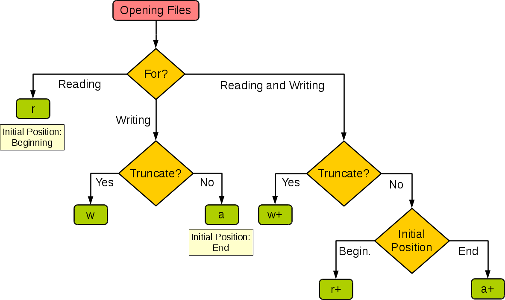

## 1 File Operation

### 1.1 File description

we often encounter scenarios where data is persisted , and the most direct and simple way to achieve data persistence is to save the data to a file.

| operating mode | specific meaning                                                   |
| -------------- | ------------------------------------------------------------------ |
| `'r'`          | read (default)                                                     |
| `'w'`          | Write (the previous content will be truncated first)               |
| `'x'`          | Writing, an exception will be generated if the file already exists |
| `'a'`          | Append, writes content to the end of an existing file              |
| `'b'`          | binary mode                                                        |
| `'t'`          | text mode (default)                                                |
| `'+'`          | Update (can both read and write)                                   |



### 1.2 Read and write text files

```python
"""
try ... except ... finally : make the code robust and fault-tolerant
"""
def main():
    f = None
    try:
        f = open('../assets/script_resource/happy.txt', 'r', encoding='utf-8')
        print(f.read())
    except FileNotFoundError:
        print('Unable to open the specified file!')
    except LookupError:
        print('An unknown encoding has been specified!')
    except UnicodeDecodeError:
        print('Decoding error while reading the file!')
    finally:
        if f:
            f.close()

if __name__ == '__main__':
    main()
```

```python
"""
Read text files three ways:
    open()                : return a file object
    with open(filename, mode, encoding=None)
        with              : Even if an exception occurs, the document can still be closed properly. Without `with`, you need to use `f.close()` to close the document.
        mode              : w : only write;  a : open file and append;  r+ : read and write; no_mode : equals to r, only read
                          : b read as binary： 如 wb rb rb+
        encoding          : suggest "utf-8"
    read()                : read all file at once 
    read(size)            : read size characters（string）或 size byte（binary）
    readlines()           : read line by line, return line list
    for_in loop read line : read line by line
    write(string or binary)  write to file by string or binary
"""
import time

def main():
    # read all file at once 
    with open('../assets/script_resource/happy.txt', 'r', encoding='utf-8') as f:
        print(f.read())
    print()
    
    # read by line 
    with open('../assets/script_resource/happy.txt', encoding='utf-8') as f:
        lines = f.readlines()            # return list
        print(''.join(lines))
    print()

    # for_in loop read
    with open('../assets/script_resource/happy.txt', mode='r', encoding='utf-8') as f:
        for line in f:
            print(line, end='')
            time.sleep(0.5)
    print()

if __name__ == '__main__':
    main()
```

### 1.3 Read and write binary files

```python
"""
read image file by read and write binary 
"""
def main():
    try:
        with open('../assets/script_resource/test.png', 'rb') as fs1:       # use rb , wb means read and write by binary format
            data = fs1.read()
            print(type(data))                      # <class 'bytes'>
        with open('../assets/script_resource/test_copy.png', 'wb') as fs2:
            fs2.write(data)
    except FileNotFoundError as e:
        print('Unable to open the specified file.')
    except IOError as e:
        print('Error occurred while reading or writing the file.')
    print('Program execution has ended.')


if __name__ == '__main__':
    main()
```

### 1.4 Read and write JSON files

* save the data in a list or dictionary to a JSON file

| JSON                | Python                                 |
| ------------------- | -------------------------------------- |
| object              | dict                                   |
| array               | list, tuple                            |
| string              | str                                    |
| number (int / real) | int, float, int- & float-derived Enums |
| true / false        | True / False                           |
| null                | None                                   |

**json function**

- `dump`- **Serialize** Python objects **into JSON files** 
- `dumps`- Process Python objects into JSON-formatted **strings**
- `load`- **Deserialize JSON file** into **objects**
- `loads`- **Deserialize** the contents of the **string** **into a Python object**

```python
import json

def main():
    mydict = {
        "name": "王二觉",
        "age": 38,
        "qq": 957658,
        "friends": ["Echuan", "Echo"],
        "cars": [
            {"brand": "BYD", "max_speed": 180},
            {"brand": "Audi", "max_speed": 280},
            {"brand": "Benz", "max_speed": 320}
        ]
    }
    try:
        with open('../assets/script_resource/write_data.json', 'w', encoding='utf-8') as fs:
            json.dump(mydict, fs, ensure_ascii=False)            # To properly save Chinese characters, Add ensure_ascii=False.
    except IOError as e:
        print(e)
    print('Save data Complete!')

    try:
        with open('../assets/script_resource/write_data.json', 'r', encoding='utf-8') as fs:
            json_obj = json.load(fs)
            print(json.dumps(json_obj, ensure_ascii=False))       # To properly display Chinese characters, Add ensure_ascii=False.
            print(json_obj)                                       # Directly output the object
    except IOError as e:
        print(e)
    print('Read data Complete!')
    
if __name__ == '__main__':
    main()
```

## 2 Dir Operation

### 2.1 os and  shutil module

```python
# os module，Interact with the operating system
import os
os.getcwd()                      # get current working directory  'C:\\Python311'
os.chdir('/server/accesslogs')   # Change working directory
os.system('mkdir today')         # mkdir in the system shell
dir(os)
help(os)           # <returns an extensive manual page created from the module's docstrings>

# shutil module, Advanced file handling and directory management
```

### 2.2 Operate Dir basic

In Python, operations for handling directories and files can be performed using the `os` and `shutil` modules from the standard library.

- **Check path is file or dir**
- **Traverse Directory**
- **Create Directory**
- **Delete Directory**
- **Find Directory**`

```python
"""
    genericpath.exists(path) : Does a path exist?
    genericpath.isfile(path) : Is a path a file?
    genericpath.isdir(path)  : Is a path a directory?
"""
import genericpath 
directory = '../script' 
print("genericpath.exists() show : " + str(genericpath.exists(directory)))
print("genericpath.isfile() show : " + str(genericpath.isfile(directory)))
print("genericpath.isdir() show : " + str(genericpath.isdir(directory)))
```

```python
"""
Traverse Directory
    os.listdir(dir_path) : Only traverse one level, return filename
    os.walk(dir_path)    : Traverse the entire directory tree, return three tuple
"""
import os 
directory = '../script' 
print("os.listdir() show:")
for filename in os.listdir(directory): 
    print(filename)                              # traverse one level and print all file_name and subdir 

print()
print("os.walk() show:")
for dirpath, dirnames, filenames in os.walk(directory):   # show by dir
    print("Current Directory:", dirpath)         
    print("Directories:", dirnames) 
    print("Files:", filenames)

"""
os.walk() show:

Current Directory: ../script
Directories: ['__pycache__']
Files: ['006_Python3_IO&Exceptions.ipynb', 's002_python3_basic_syntax.ipynb', 's003_practice_tic_tac_toe.py', 's003_Python3_Data_Structure.ipynb', 's004_Python3_Function&Moudule.ipynb', 's004_sample_module1.py', 's004_sample_module2.py', 's004_sample_module3.py', 's005_Python3_OOP.ipynb']

Current Directory: ../script\__pycache__
Directories: []
Files: ['s004_sample_module1.cpython-311.pyc', 's004_sample_module2.cpython-311.pyc', 's004_sample_module3.cpython-311.pyc']
"""
```

```python
"""
Create Directory
    `os.mkdir()` to create a single directory  
    `os.makedirs()` to create intermediate directories as needed
"""
import os

already_exists_dir = '../assets/script_resource/'
new_directory = already_exists_dir + 'test_mkdir'
new_directories = already_exists_dir + 'test_mkdir/parent_directory/child_directory'

os.mkdir(new_directory)       # create a single directory
os.makedirs(new_directories)  # create intermediate directories as needed
```

```python
"""
Delete Directory 
    * os.rmdir() to remove a single empty directory 
    * shutil.rmtree() to remove a directory and all its contents.
"""
import os
import shutil

already_exists_dir = '../assets/script_resource/'
empty_directory = already_exists_dir + 'test_mkdir/parent_directory/child_directory'
non_empty_directory = already_exists_dir + 'test_mkdir'

os.rmdir(empty_directory)           # remove a single empty directory
shutil.rmtree(non_empty_directory)  # remove a directory and all its contents
```

```python
"""
Find Directory
    os.walk() + if , to travelse and find
    os.path.exists()` to check if a specific directory exists.
    glob.glob('*.py') : find file by Unix style pathname pattern expansion
        - `*.txt`：匹配所有以 `.txt` 结尾的文件。
        - `subdir/*.py`：匹配 `subdir` 子目录下的所有 `.py` 文件。
        - `**/*.py`：递归匹配当前目录及所有子目录下的 `.py` 文件（需要使用 `glob.glob('**/*.py', recursive=True)`）。
"""
import glob
import os

directory = '../assets/script_resource/happy.txt'

if os.path.exists(directory):              # Determine whether file or dir exists
    print("Directory exists.")
else:
    print("Directory does not exist.")
    
glob_path = '../script/*.py'
glob.glob('*.py')                           # ['s003_practice_tic_tac_toe.py', 's004_sample_module1.py', 's004_sample_module2.py', 's004_sample_module3.py']
```

### 2.3 shutil Advanced handling

```python
"""
shutil : Advanced file handling and directory management
"""
import shutil
copy_path = '../assets/script_resource/copy'
move_path = '../assets/script_resource/move'
if not os.path.exists(copy_path):              # Determine whether file or dir exists
    os.makedirs(copy_path)
if not os.path.exists(move_path):              # Determine whether file or dir exists
    os.makedirs(move_path)
shutil.copyfile('../assets/script_resource/happy.txt', copy_path + '/happy_copy.txt')               # copy move won't create dir
shutil.move('../assets/script_resource/copy/happy_copy.txt', move_path + '/happy_move.txt')        
```

## 3 Exception

### 3.1 Exception handle

```python
"""
try ... except ... finally ...
"""
import sys
try:
    f = open('myfile.txt')
    s = f.readline()
    i = int(s.strip())
except OSError as err:
    print("OS error:", err)
except ValueError:
    print("Could not convert data to an integer.")
except Exception as err:
    print(f"Unexpected {err=}, {type(err)=}")
    raise
finally:
    print('Goodbye, world!')  
```

### 3.2 Exception raise

```python
"""
raise
"""
# Propagate upward, passing the exception to upstream for handling
def func():
    raise ConnectionError 
    
try:
    func()
except ConnectionError as exc:
    raise RuntimeError('Failed to open database') from exc
```

