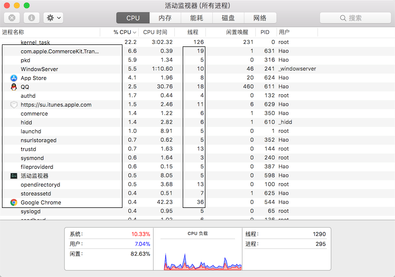

## 1 concept

A process is a program executed in the OS. The operating system allocates storage space in units of processes[](以进程为单位). Each process has its own address space, data stack and other auxiliary[](辅助) data for tracking process execution. The operating system manages the execution of all processes. , allocate resources reasonably[](合理的) to them.
A process can create a new process through fork or spawn to perform other tasks.
However, the new process also has its own independent memory space, so data sharing must be achieved[](实现,达到) through the inter-process communication mechanism[](通信机制) (IPC, Inter-Process Communication). Specific methods include pipes, signals, sockets, shared memory areas, etc.

A process can also have multiple concurrent execution threads. Since threads operate within the same process, they can share the same context, making information sharing and communication between threads easier compared to processes.

  

Python supports both multiprocessing and multithreading, so there are three main ways to implement concurrent programming in Python: 
* multiprocessing
* multithreading
* a combination of both multiprocessing and multithreading.

## 2 Multiprocessing in Python

> [multiprocessing module](https://docs.python.org/3/library/multiprocessing.html) 

Unix and Linux operating systems
* create child processes : `fork()`   The parent process that calls the `fork()` function to creates a child process, which is a copy of the parent process but has its own PID. 

Windows OS:
* create child processes : use the `Process` class from the `multiprocessing` module.   
* `multiprocessing` module :
    * offer process pools (`Pool`) for batch process launching, 
    * queues (`Queue`) and pipes (`Pipe`) for inter-process communication


```python
"""
    Process class : create a process object
    Parameter:
        target    : function name
        arg       : arg to function
    Functions:
        process.start()  : start process
        process.join()   : wait process finish
"""
from multiprocessing import Process
from os import getpid
from random import randint
from time import time, sleep


def download_task(filename):
    print('Start download, The Process ID is [%d].' % getpid())
    print('Start download %s...' % filename)
    time_to_download = randint(5, 10)
    sleep(time_to_download)
    print('%s Complete! Total of %d seconds' % (filename, time_to_download))


def main():
    start = time()
    p1 = Process(target=download_task, args=('Python从入门到住院.pdf', ))
    p1.start()
    p2 = Process(target=download_task, args=('Peking Hot.avi', ))
    p2.start()
    p1.join()
    p2.join()
    end = time()
    print('Total used of %.2f seconds.' % (end - start))
    
if __name__ == '__main__':
    main()
```

## 2 Multithreadinging in Python

> [threading](https://docs.python.org/3/library/threading.html)

### 2.1 threading

Python in early versions, the `thread` module (now named `_thread`) was introduced for multithreading programming. However, this module is quite low-level and lacks many features.

For Python multithreading development, it is recommended to use the `threading` module, which provides a better object-oriented encapsulation for multithreaded programming.

```python
"""
Use `Thread` class in threading module to create thread
the usage is similar to Process Class
    Parameter:
        target    : exec function name
        arg       : arg to function
    Functions:
        thread.start()  : start thread
        thread.join()   : wait thread finish
    
"""
from random import randint
from threading import Thread
from time import time, sleep


def download(filename):
    print('Start download %s...' % filename)
    time_to_download = randint(5, 10)
    sleep(time_to_download)
    print('%s Complete! Total of %d seconds' % (filename, time_to_download))

def main():
    start = time()
    t1 = Thread(target=download, args=('Python从入门到住院.pdf',))
    t1.start()
    t2 = Thread(target=download, args=('Peking Hot.avi',))
    t2.start()
    t1.join()
    t2.join()
    end = time()
    print('Total used of %.2f seconds.' % (end - start))

if __name__ == '__main__':
    main()
```

```python
"""
Create a custome thread by Inheriting from Thread Class, and then create thread objects and start the threads.
"""
from random import randint
from threading import Thread
from time import time, sleep


class DownloadTask(Thread):

    def __init__(self, filename):
        super().__init__()
        self._filename = filename

    def run(self):
        print('Start Download %s...' % self._filename)
        time_to_download = randint(5, 10)
        sleep(time_to_download)
        print('%sDownload Complete! Speed %d Seconds' % (self._filename, time_to_download))


def main():
    start = time()
    t1 = DownloadTask('Python从入门到住院.pdf')
    t1.start()
    t2 = DownloadTask('Peking Hot.avi')
    t2.start()
    t1.join()
    t2.join()
    end = time()
    print('Total time spent: %.2f seconds.' % (end - start))


if __name__ == '__main__':
    main()
```


### 2.2 Lock


When multiple threads share the same resource (variable), it can lead to unpredictable[](不可控) results, potentially causing the program to fail or crash. In such cases, a "`lock`" can be useful.
We can use locks to protect the same resource. **Only the thread that acquires the lock[](获得锁) can access this resource**, while other threads that do not have the lock will be blocked until the thread that holds the lock releases it. 

```python
from time import sleep
from threading import Thread, Lock

class Account(object):

    def __init__(self):
        self._balance = 0
        self._lock = Lock()

    def deposit(self, money):
        # Only acquires the lock can run the below code
        self._lock.acquire()
        try:
            new_balance = self._balance + money
            sleep(0.01)
            self._balance = new_balance
        finally:
            # Ensure that locks are properly released
            self._lock.release()

    @property
    def balance(self):
        return self._balance


class AddMoneyThread(Thread):

    def __init__(self, account, money):
        super().__init__()
        self._account = account
        self._money = money

    def run(self):
        self._account.deposit(self._money)


def main():
    account = Account()
    threads = []
    for _ in range(100):
        t = AddMoneyThread(account, 1)            # init thread 
        threads.append(t)                         # collect all threads
        t.start()                                 # run thread
    for t in threads:
        t.join()                                  # wait thread finish
    print('Accout Balance: ￥%d Yuan' % account.balance)


if __name__ == '__main__':
    main()
```

## 3 When use Process or thread

Whether in multiprocessing or multithreading, as the number of tasks increases, efficiency is unlikely to improve.

When deciding whether to use multitasking, it's important to consider the type of tasks, which can be divided into CPU-bound tasks and I/O-bound tasks.

- **CPU-bound tasks** are characterized[](特点) by requiring extensive computations[](大量计算), consuming CPU resources, such as video encoding/decoding or format conversion. Although these tasks can be performed using multitasking, as the number of tasks increases, more time is spent on task switching, which lowers the CPU's efficiency. Scripting languages like Python are typically less efficient for these tasks; C is often better suited for this type of work. Python does allow embedding[](嵌入) C/C++ code for performance improvements.
    
- **I/O-bound tasks** can benefit from multitasking because it reduces I/O wait time, allowing the CPU to operate more efficiently. A large category of tasks falls into this category, including network applications and web applications, which we will be exploring soon.


