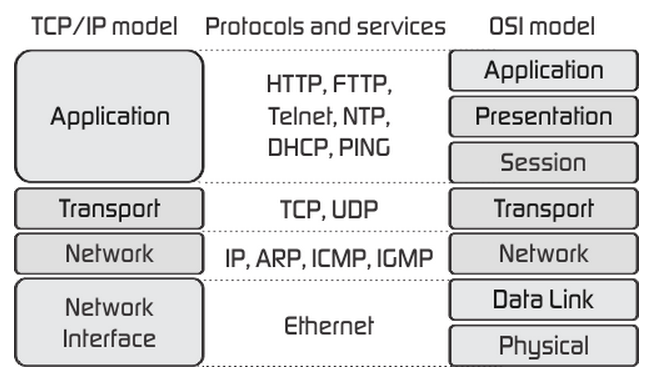
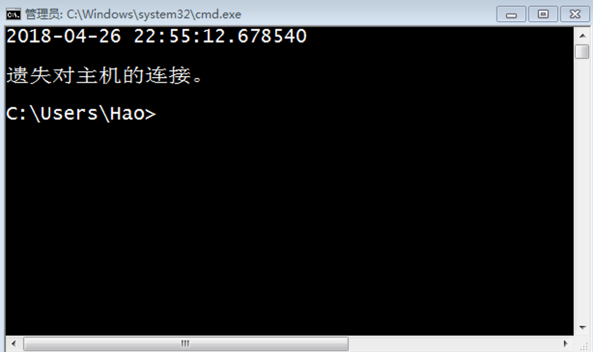

## 1 Fundamentals of Computer Networks

### 1.1 TCP/IP model

The TCP/IP model logically breaks down%%分解%% the networks we use into four layers, from bottom to top: **Network Interface, Network, Transport, and Application**, as shown in the figure below.




### 1.2 Network Application Models

1. C/S AND B/S： "C" refers to Client, which is usually an application that needs to be installed on a host operating system; "B" refers to Browser, which is an application software that is typically pre-installed on all graphical operating systems. Access to "S" (Server) can be achieved through either C or B.
2. Decentralized Network Application Models(去中心化的网络应用模式)。There is no central server or authorization center; each node can communicate directly with other nodes. This model is more resilient and harder to attack compared to traditional centralized models (where all communication must go through a central server) because there is no single point of failure. Common examples of decentralized networks include blockchain technology (such as Bitcoin) and distributed file systems (such as IPFS, InterPlanetary File System). In these systems, all nodes share and maintain the overall state of the network.

## 2 Developing Based on the HTTP Protocol

```python
pip install requests
```

`requests` is a **third-party library** based on the HTTP protocol that facilitates(便利 facilitate) network use. By using the `requests` library, you can easily work with HTTP, avoiding security flaws(安全缺陷), redundant code(冗余代码), and the "reinventing the wheel"(重复造轮子) phenomenon(现象) (recreating an existing or already optimized basic method).

Below, we will implement an example program using `requests` to access a web data interface, retrieve download links for beautiful images, and download those images to the local machine. The program utilizes the web API provided by [tianapi](https://www.tianapi.com/).

```python
from time import time
from threading import Thread

import requests


# Inhert Thread Class and create custom Thread Class
class DownloadHanlder(Thread):

    def __init__(self, url):
        super().__init__()
        self.url = url

    def run(self):
        filename = self.url[self.url.rfind('/') + 1:]
        resp = requests.get(self.url)
        with open('/Users/Hao/' + filename, 'wb') as f:
            f.write(resp.content)


def main():
    # `get` function to get network resources
    resp = requests.get(
        'http://api.tianapi.com/meinv/?key=APIKey&num=2')    # use tianapi API
    # Parse the JSON-formatted data returned by the server into a dict
    data_model = resp.json()
    for mm_dict in data_model['newslist']:
        url = mm_dict['picUrl']
        # Implement image downloading using multithreading
        DownloadHanlder(url).start()


if __name__ == '__main__':
    main()
```

## 3 Developing Based on the Transport Protocol

A socket is a set of application development libraries written in C, primarily used for inter-process communication and network programming, and is widely used in network application development. In Python, you can also use sockets to access transport services provided by the transport layer and develop your own network applications based on this.

The sockets used in actual development(实际开发中) can be categorized into three types:
1. Stream Sockets (TCP Sockets)
2. Datagram Sockets
3. Raw Sockets.

### 3.1 TCP Sockets

#### 3.1.1 TCP Socket Describe

TCP Sockets are programming interfaces that use the transport services provided by the TCP protocol to achieve network communication(实现网络通信). In Python, you can create a socket object and specify the type attribute as `SOCK_STREAM` to use TCP sockets.

The server-side program needs to bind the socket object to a specified IP address and port after its creation. The port is not a physical device but an extension of the IP address used to distinguish(区分) different services. For example, we typically(通常) bind HTTP services to port 80, while the MySQL database service is usually bound to port 3306. This way, when the server receives a user request, it can determine whether the request is for the HTTP server or the database server based on the port number.

The range of port values is from 0 to 65535. Ports below 1024 are usually referred to as "well-known ports" (reserved for services like FTP, HTTP, SMTP, etc.; sometimes called "known ports"). Custom services typically do not use these ports unless they are customizing well-known services like HTTP or FTP.

#### 3.1.2 Simple Case

```python
"""
Implemented a server that provides date and time
"""
from socket import socket, SOCK_STREAM, AF_INET
from datetime import datetime


def main():
    # 1.Create a socket object and specify which transport service to use
    # family=AF_INET    - IPv4 Address
    # family=AF_INET6   - IPv6 Address
    # type=SOCK_STREAM  - TCP Socket
    # type=SOCK_DGRAM   - UDP Socket
    # type=SOCK_RAW     - RAW Socket
    server = socket(family=AF_INET, type=SOCK_STREAM)
    # 2.Bind Ip and port(port used to distinguish different services)
    # At the same time, only one service can be bound to the same port; otherwise, an error will occur
    server.bind(('192.168.1.2', 6789))
    # 3.Start listening - listen for client connections to the server
    # 512 can be understood as the size of the connection queue
    server.listen(512)
    print('Server start listening ...')
    while True:
        # 4.Receive client connections in a loop and respond accordingly(做出对应回应) (provide services)
        # accept() is a blocking method; if no client connections, the code will not execute further(向下执行).
        # accept() returns a tuple 
	        # the first element is the client object.
	        # The second element is the address of the client (composed of the IP and port).
        client, addr = server.accept()
        print(str(addr) + ' connected to the server.')
        # 5.Send Data
        client.send(str(datetime.now()).encode('utf-8'))
        # 6.Close Connection
        client.close()


if __name__ == '__main__':
    main()
```

After running the server program, we can access the server using Telnet on Windows, as shown in the diagram below.。

```shell
telnet 192.168.1.2 6789
```



We can also implement the functionality of a TCP client using a Python program. Compared to implementing a server program, creating a client program is much simpler. The code is as follows:

```python
from socket import socket


def main():
    # 1.Create a socket object that defaults to using IPv4 and the TCP protocol
    client = socket()
    # 2.Connect to the server (specifying the IP address and port).
    client.connect(('192.168.1.2', 6789))
    # 3.Receive data from the server.
    print(client.recv(1024).decode('utf-8'))
    client.close()

if __name__ == '__main__':
    main()
```


#### 3.1.3 Multithreading Case

The above server does not use multithreading or asynchronous I/O, which means that **when the server is communicating with one client, other clients must wait in line**. We need a server that can simultaneously accept and handle multiple user requests. Below, we will design a server that uses multithreading to handle multiple user requests, which will send an image to the clients connected to the server.

```python
from socket import socket, SOCK_STREAM, AF_INET
from base64 import b64encode
from json import dumps
from threading import Thread


def main():
    
    # custome Thread Class
    class FileTransferHandler(Thread):

        def __init__(self, cclient):
            super().__init__()
            self.cclient = cclient

        def run(self):
            my_dict = {}
            my_dict['filename'] = 'guido.jpg'
            # JSON is plain text, so the binary data needs to be processed into base64 encoding.
            my_dict['filedata'] = data
            # dumps make dict to JSON str
            json_str = dumps(my_dict)
            # send JSON str
            self.cclient.send(json_str.encode('utf-8'))
            self.cclient.close()

    # 1.创建套接字对象并指定使用哪种传输服务
    server = socket()
    # 2.绑定IP地址和端口(区分不同的服务)
    server.bind(('192.168.1.2', 5566))
    # 3.开启监听 - 监听客户端连接到服务器
    server.listen(512)
    print('服务器启动开始监听...')
    with open('guido.jpg', 'rb') as f:
        # 将二进制数据处理成base64再解码成字符串
        data = b64encode(f.read()).decode('utf-8')
    while True:
        client, addr = server.accept()
        # 启动一个线程来处理客户端的请求
        FileTransferHandler(client).start()


if __name__ == '__main__':
    main()
```

Client Code：

```python
from socket import socket
from json import loads
from base64 import b64decode


def main():
    client = socket()
    client.connect(('192.168.1.2', 5566))
    # create a byte obj to save receive data
    in_data = bytes()
    # Since the size of the data sent by the server is unknown, receive 1024 bytes at a time.
    data = client.recv(1024)
    while data:
        # Concatenate(拼接) the received data
        in_data += data
        data = client.recv(1024)
    # decode received data to json string by utf-8  
    # loads make json string to dict
    my_dict = loads(in_data.decode('utf-8'))
    filename = my_dict['filename']
    filedata = my_dict['filedata'].encode('utf-8')
    with open('/Users/Hao/' + filename, 'wb') as f:
        # 将base64格式的数据解码成二进制数据并写入文件
        f.write(b64decode(filedata))
    print('图片已保存.')


if __name__ == '__main__':
    main()
```

在这个案例中，我们使用了JSON作为数据传输的格式（通过JSON格式对传输的数据进行了序列化和反序列化的操作），但是JSON并不能携带二进制数据，因此对图片的二进制数据进行了Base64编码的处理。Base64是一种用64个字符表示所有二进制数据的编码方式，通过将二进制数据每6位一组的方式重新组织，刚好可以使用0~9的数字、大小写字母以及“+”和“/”总共64个字符表示从`000000`到`111111`的64种状态。[维基百科](https://zh.wikipedia.org/wiki/Base64)上有关于Base64编码的详细讲解，不熟悉Base64的读者可以自行阅读。

> **说明：** 上面的代码主要为了讲解网络编程的相关内容因此并没有对异常状况进行处理，请读者自行添加异常处理代码来增强程序的健壮性。

### 3.2 UDP套接字

传输层除了有可靠的传输协议TCP之外，还有一种非常轻便的传输协议叫做用户数据报协议，简称UDP。TCP和UDP都是提供端到端传输服务的协议，二者的差别就如同打电话和发短信的区别，后者不对传输的可靠性和可达性做出任何承诺从而避免了TCP中握手和重传的开销，所以在强调性能和而不是数据完整性的场景中（例如传输网络音视频数据），UDP可能是更好的选择。可能大家会注意到一个现象，就是在观看网络视频时，有时会出现卡顿，有时会出现花屏，这无非就是部分数据传丢或传错造成的。在Python中也可以使用UDP套接字来创建网络应用，对此我们不进行赘述，有兴趣的读者可以自行研究。

## 4 网络应用开发

### 4.1 发送电子邮件

在即时通信软件如此发达的今天，电子邮件仍然是互联网上使用最为广泛的应用之一，公司向应聘者发出录用通知、网站向用户发送一个激活账号的链接、银行向客户推广它们的理财产品等几乎都是通过电子邮件来完成的，而这些任务应该都是由程序自动完成的。

就像我们可以用HTTP（超文本传输协议）来访问一个网站一样，发送邮件要使用SMTP（简单邮件传输协议），SMTP也是一个建立在TCP（传输控制协议）提供的可靠数据传输服务的基础上的应用级协议，它规定了邮件的发送者如何跟发送邮件的服务器进行通信的细节，而Python中的smtplib模块将这些操作简化成了几个简单的函数。

下面的代码演示了如何在Python发送邮件。

```python
from smtplib import SMTP
from email.header import Header
from email.mime.text import MIMEText


def main():
    # 请自行修改下面的邮件发送者和接收者
    sender = 'abcdefg@126.com'
    receivers = ['uvwxyz@qq.com', 'uvwxyz@126.com']
    message = MIMEText('用Python发送邮件的示例代码.', 'plain', 'utf-8')
    message['From'] = Header('王大锤', 'utf-8')
    message['To'] = Header('骆昊', 'utf-8')
    message['Subject'] = Header('示例代码实验邮件', 'utf-8')
    smtper = SMTP('smtp.126.com')
    # 请自行修改下面的登录口令
    smtper.login(sender, 'secretpass')
    smtper.sendmail(sender, receivers, message.as_string())
    print('邮件发送完成!')


if __name__ == '__main__':
    main()
```

如果要发送带有附件的邮件，那么可以按照下面的方式进行操作。

```python
from smtplib import SMTP
from email.header import Header
from email.mime.text import MIMEText
from email.mime.image import MIMEImage
from email.mime.multipart import MIMEMultipart

import urllib


def main():
    # 创建一个带附件的邮件消息对象
    message = MIMEMultipart()
    
    # 创建文本内容
    text_content = MIMEText('附件中有本月数据请查收', 'plain', 'utf-8')
    message['Subject'] = Header('本月数据', 'utf-8')
    # 将文本内容添加到邮件消息对象中
    message.attach(text_content)

    # 读取文件并将文件作为附件添加到邮件消息对象中
    with open('/Users/Hao/Desktop/hello.txt', 'rb') as f:
        txt = MIMEText(f.read(), 'base64', 'utf-8')
        txt['Content-Type'] = 'text/plain'
        txt['Content-Disposition'] = 'attachment; filename=hello.txt'
        message.attach(txt)
    # 读取文件并将文件作为附件添加到邮件消息对象中
    with open('/Users/Hao/Desktop/汇总数据.xlsx', 'rb') as f:
        xls = MIMEText(f.read(), 'base64', 'utf-8')
        xls['Content-Type'] = 'application/vnd.ms-excel'
        xls['Content-Disposition'] = 'attachment; filename=month-data.xlsx'
        message.attach(xls)
    
    # 创建SMTP对象
    smtper = SMTP('smtp.126.com')
    # 开启安全连接
    # smtper.starttls()
    sender = 'abcdefg@126.com'
    receivers = ['uvwxyz@qq.com']
    # 登录到SMTP服务器
    # 请注意此处不是使用密码而是邮件客户端授权码进行登录
    # 对此有疑问的读者可以联系自己使用的邮件服务器客服
    smtper.login(sender, 'secretpass')
    # 发送邮件
    smtper.sendmail(sender, receivers, message.as_string())
    # 与邮件服务器断开连接
    smtper.quit()
    print('发送完成!')


if __name__ == '__main__':
    main()
```

### 4.2 发送短信

发送短信也是项目中常见的功能，网站的注册码、验证码、营销信息基本上都是通过短信来发送给用户的。在下面的代码中我们使用了[互亿无线](http://www.ihuyi.com/)短信平台（该平台为注册用户提供了50条免费短信以及常用开发语言发送短信的demo，可以登录该网站并在用户自服务页面中对短信进行配置）提供的API接口实现了发送短信的服务，当然国内的短信平台很多，读者可以根据自己的需要进行选择（通常会考虑费用预算、短信达到率、使用的难易程度等指标），如果需要在商业项目中使用短信服务建议购买短信平台提供的套餐服务。

```python
import urllib.parse
import http.client
import json


def main():
    host  = "106.ihuyi.com"
    sms_send_uri = "/webservice/sms.php?method=Submit"
    # 下面的参数需要填入自己注册的账号和对应的密码
    params = urllib.parse.urlencode({'account': '你自己的账号', 'password' : '你自己的密码', 'content': '您的验证码是：147258。请不要把验证码泄露给其他人。', 'mobile': '接收者的手机号', 'format':'json' })
    print(params)
    headers = {'Content-type': 'application/x-www-form-urlencoded', 'Accept': 'text/plain'}
    conn = http.client.HTTPConnection(host, port=80, timeout=30)
    conn.request('POST', sms_send_uri, params, headers)
    response = conn.getresponse()
    response_str = response.read()
    jsonstr = response_str.decode('utf-8')
    print(json.loads(jsonstr))
    conn.close()


if __name__ == '__main__':
    main()
```